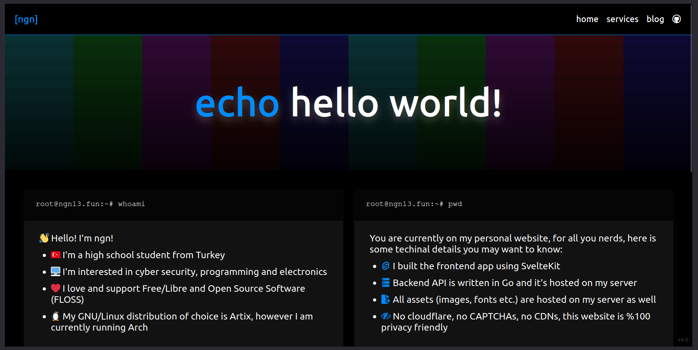
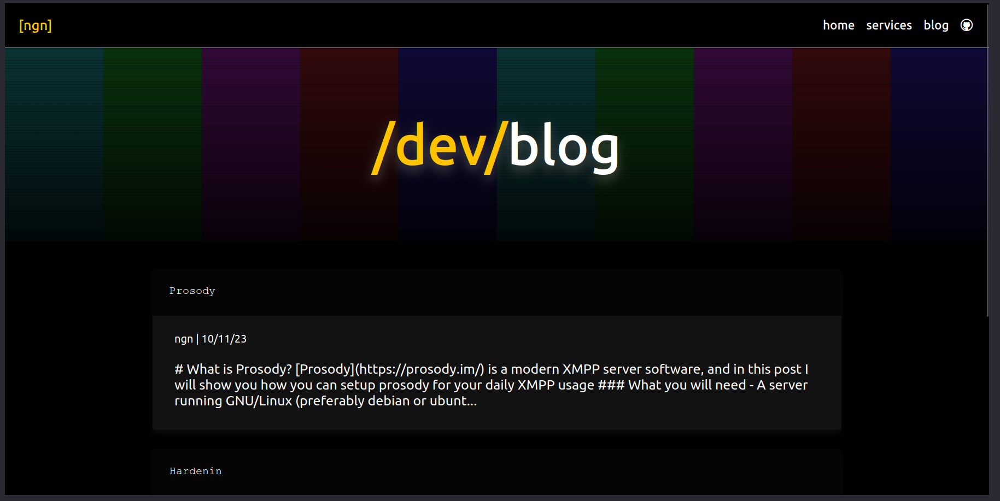

# website | my personal website


This repo contains all the source code for my personal website, [ngn.tf](https://ngn.tf)
All code is licensed under AGPL version 3 (see [LICENSE.txt](LICENSE.txt))

> **Note**  
> I do not accept PRs as this is just my personal project. 

## Directory structure
### `app`
Contains frontend application, written with SvelteKit. It supports full SSR.
Contains modified CSS from [github-markdown-css](https://github.com/sindresorhus/github-markdown-css)
and fonts from [NerdFonts](https://www.nerdfonts.com/)

### `api`
Contains the API server, written in Go. It uses the [Fiber](https://github.com/gofiber/fiber) web 
framework which offers an [Express](https://expressjs.com/) like experience. I choose Fiber since I've used worked with express a lot in the past. However previously the I was using 
[Gin](https://github.com/gin-gonic/gin) (see history section).

API stores all the data in a local sqlite(3) database. Go doesn't support sqlite3 out of the box so 
I'm using [mattn's sqlite3 driver](https://github.com/mattn/go-sqlite3).

### `admin`
The frontend application does not contain an admin interface, I do the administration stuff (such as 
adding posts, adding services etc.) using the python script in this directory. This script can be 
installed on to the PATH by running the `install.sh` script. After installation it can be used  
by running `admin_script`.

## Deployment
Easiest way to deploy is to use docker. I have created a `compose.yaml` file so the API and the 
frontend application can be deployed easily with just the `docker compose up` command:
```yaml
services:
    app:
        build: ./app
        ports:
            - "127.0.0.1:7002:7002"
        depends_on:
            - api
        enviroment:
            - VITE_API_URL_DEV="https://api.ngn.tf"

    api:
        build: ./api
        ports:
            - "127.0.0.1:7001:7001"
        volumes:
            - ./api/api.db:/api.db
        enviroment:
            - PASS=securepassword
```

## History
Some nostalgic history/changelog stuff (just for the major version numbers):

- **v0.1 (late 2020 - early 2021)**: First ever version of my website, it was just a simple HTML/CSS page, 
I never published any of the source code and I wiped the local copy on my USB drive in early 2022.

- **v1.0 (early 2021 - late 2022)**: This version was actualy hosted on my github.io page, and all the source code was (and still is) avaliable, it was just a simple static site, [here is a screenshot](assets/githubio.png).

- **vLOST (late 2022 - early 2023)**:  As I learned more JS, I decided to rewrite (and rework) 
my website with one of the fancy JS frameworks. I decided to go with Svelte. Not the kit version,
at the time svelte did not support SSR. I do not remember writting an API for it so I guess I just 
updated it everytime I wanted to add content? It was pretty much like a static website and was hosted 
on `ngn13.fun` as at this point I had my own hosting. The source code for this website was in a 
deleted github repository of mine, I looked for a local copy on my old hard drive but I wasn't able 
to find it. I also do not remember how it looked like, sooo this version is pretty much lost :(

- **v2.0 (early 2022 - late 2023)**: After I discovered what SSR is, I decided to rewrite and rework 
my website one more time in NuxtJS. I had really "fun time" using vue stuff. As NuxtJS supported 
server-side code, this website had its own built in API. This website was also hosted on `ngn13.fun`

- **v3.0 (2023 august - 2023 november)**: In agust of 2023, I decided to rewrite and rework my website 
again, this time I was going with SvelteKit as I haven't had the greatest experience with NuxtJS.
SvelteKit was really fun to work with and I got my new website done pretty quickly. (I don't wanna 
brag or something but I really imporeved the CSS/styling stuff ya know). I also wrote a new API 
with Go and Gin. I did not publish the source code for the API, its still on my local gitea 
server tho. This website was hosted on `ngn13.fun` as well.

- **v4.0 (2023 november -)** The current major version of my website. The frontend is still 
similar to 3.0, the big changes are in the API. I rewrote the API with Fiber. This version is 
hosted on `ngn.tf` which is my new domain name btw.

## Screenshots


