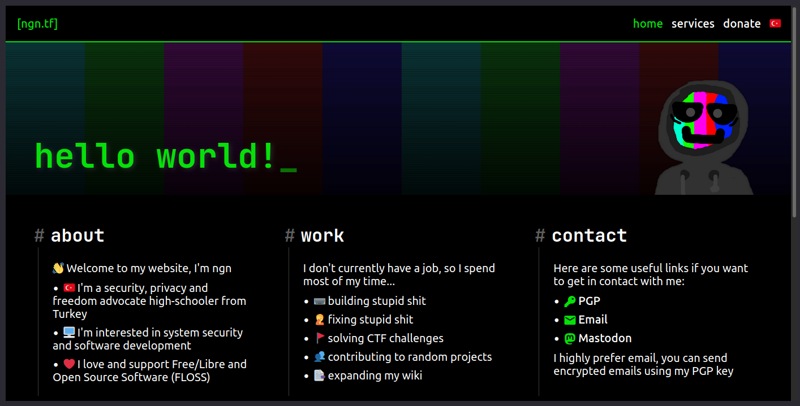
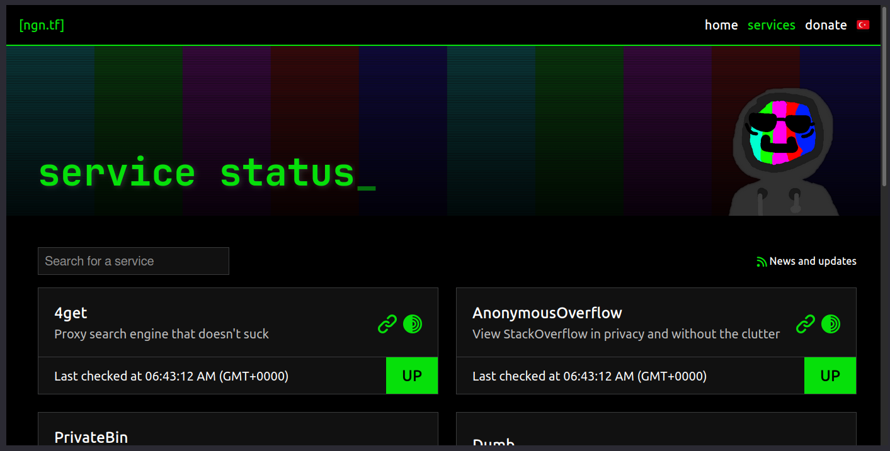

# website | my personal website

This repo contains all the source code for my personal website, [ngn.tf](https://ngn.tf)
All code is licensed under AGPL version 3 (see [LICENSE.txt](LICENSE.txt))

## Directory structure
### `app`
Contains frontend application, written with SvelteKit. It supports full SSR.
Contains modified CSS from [github-markdown-css](https://github.com/sindresorhus/github-markdown-css)
and fonts from [NerdFonts](https://www.nerdfonts.com/)

### `api`
Contains the API server, written in Go. It uses the [Fiber](https://github.com/gofiber/fiber) web
framework which offers an [Express](https://expressjs.com/) like experience. I choose Fiber since I've used
worked with express a lot in the past. However previously the I was using [Gin](https://github.com/gin-gonic/gin)
(see history section).

API stores all the data in a local SQLite(3) database. Go doesn't support SQLite3 out of the box so
I'm using [mattn's sqlite3 driver](https://github.com/mattn/go-sqlite3).

### `doc`
Contains the documentation server, written in C. It uses the [ctorm](https://github.com/ngn13/ctorm) web
framework, which is a framework that I myself wrote. Unlike the frontend application or the API server, it's not
accessable by public, the frontend application gets the documentation content from this server and renders it using
SSR. The reason I don't use the API for hosting the documentation content is that I want a separate server for hosting
static content, API is only for hosting dynamic stuff.

### `admin`
The frontend application does not contain an admin interface, I do the administration stuff (such as adding news posts,
adding services etc.) using the python script in this directory. This script can be installed on to the PATH by running
the Makefile install script. After installation it can be used by running `admin_script`.

## Deployment
Easiest way to deploy is to use docker. There is `compose.yml` and a `run.sh` script in the [deploy](deploy/) directory
that can be used to startup all the docker containers. Configuration options are passed during build time for the frontend
application, and for others it's passed with environment variables.

## History
Some nostalgic history/changelog stuff (just for the major version numbers):

- **v0.1 (late 2020 - early 2021)**: First ever version of my website, it was just a simple HTML/CSS page,
I never published any of the source code and I wiped the local copy on my USB drive in early 2022, I still
remember what it looked like though, it looked like I made entire website in microsoft paint... while blindfoled,
so yeah it was shit.

- **v1.0 (early 2021 - late 2022)**: This version was actualy hosted on my github.io page, and all the source code
was (and still is) avaliable, it was just a simple static site, [here is a screenshot](assets/githubio.png).

- **vLOST (late 2022 - early 2023)**:  As I learned more JS, I decided to rewrite (and rework) my website with one
of the fancy JS frameworks. I decided to go with Svelte. Not the kit version, at the time svelte did not support SSR.
I do not remember writting an API for it so I guess I just updated it everytime I wanted to add content? It was pretty
much like a static website and was hosted on `ngn13.fun` as at this point I had my own hosting. The source code for
this website was in a deleted github repository of mine, I looked for a local copy on my old hard drive but I wasn't able
to find it. I also do not remember how it looked like, sooo this version is pretty much lost :(

- **v2.0 (early 2023 - late 2023)**: After I discovered what SSR is, I decided to rewrite and rework my website one more
time in NuxtJS. I had really "fun" time using vue stuff. As NuxtJS supported server-side code, this website had its own
built in API. This website was also hosted on `ngn13.fun`. This also the first version that lives on this git repository.

- **v3.0 (2023 august - 2023 november)**: In agust of 2023, I decided to rewrite and rework my website again, this time
I was going with SvelteKit as I haven't had the greatest experience with NuxtJS. SvelteKit was really fun to work with
and I got my new website done pretty quickly. (I don't wanna brag or something but I really imporeved the CSS/styling
stuff ya know). I also wrote a new API with Go and Gin. I did not publish the source code for the API, the code lived
on my local git server until I deleted it when I was done with 6.0. This website was hosted on `ngn13.fun` as well.

- **v4.0 (2023 november - 2024 october)**: In this version the frontend was still similar to 3.0, the big changes are in
the API. I rewrote the API with Fiber. This version was the first version hosted on `ngn.tf` which is my new domain name.
Here is a [picture of the index](assets/4.0_index.png) and the [blog page](assets/4.0_blog.png).

- **v5.0 (2024 october - 2025 january)**: This version just had simple frontend UI changes compared to 4.0, at this
point I was thinking about doing a massive rework (which I did with 6.0), however I was working on some other shit at
the time, so I just did some small changes with the limited time I had for this project.

- **v6.0 (2025 january - ...)**: The current major version of my website, frontend had a massive rework, API has been
cleaned up and extended to do status checking for the services I host. The `doc` server has been added to the mix
so I can host static documentation. The most important thing about this version is that it adds multi-language support,
so literally everything on the website (including the API and documentation content) is localized for both English
and Turkish, which was something I wanted to do for the longest time ever.

Damn it has been 4 years since I wrote that shit HTML page huh? Time flies...

## Screenshots (from v6.0)

